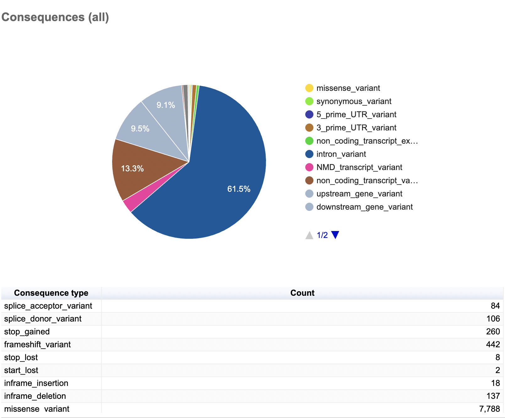
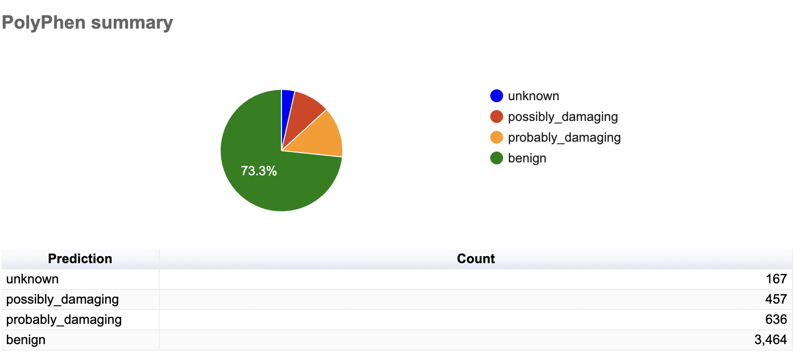

# Germline Trio Variant Calling — GIAB HG005, HG006 and HG007 

Trio variant calling pipeline applied to chromosome 17, using whole exome sequencing 
data from the [GIAB Chinese Trio](https://www.nist.gov/programs-projects/genome-bottle) 
(HG005/HG006/HG007). Variants are filtered against the 
[ACMG SF v3.2 gene panel](https://www.gimjournal.org/article/S1098-3600(25)00101-7/fulltext) 
to flag medically actionable secondary findings.

## Samples

| Role | Sample | Source |
|------|--------|--------|
| Proband | HG005 (son) | [NCBI FTP](https://ftp-trace.ncbi.nlm.nih.gov/giab/ftp/data/ChineseTrio/HG005_NA24631_son/HG005_NA24631_son_HiSeq_300x/NHGRI_Illumina300X_Chinesetrio_novoalign_bams/) |
| Father | HG006 | [NCBI FTP](https://ftp-trace.ncbi.nlm.nih.gov/giab/ftp/data/ChineseTrio/HG006_NA24694-huCA017E_father/NA24694_Father_HiSeq100x/NHGRI_Illumina100X_Chinesetrio_novoalign_bams/) |
| Mother | HG007 | [NCBI FTP](https://ftp-trace.ncbi.nlm.nih.gov/giab/ftp/data/ChineseTrio/HG007_NA24695-hu38168_mother/NA24695_Mother_HiSeq100x/NHGRI_Illumina100X_Chinesetrio_novoalign_bams/) |

## Structure 

```
├── config/
├── data/
│   ├── raw/
│   ├── reference/
│   └── ...
├── envs/
├── results/
│   ├── qc/
│   └── vep/
└── scripts/
...
```

## Example outputs

### ACMG Report csv


### VEP Stats Snippet





